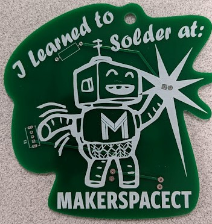
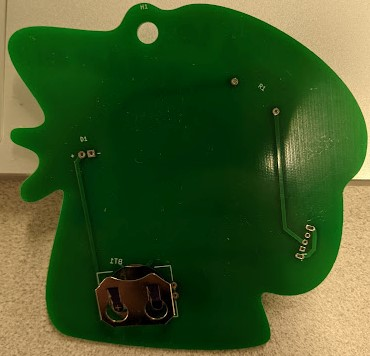

# Learn to Solder at MCT

## Intro

If you've found your way here, it's probably because you are (or were) learning to solder at MakerspaceCT or at one of our events. The v1.0 kit features a robot and a color-changing light, pictured below:

## Bill of materials
* PCB
Front:
* Switch (S1)
* 150Ω Resistor (R1)
* LED (D1)
Back:
* 20mm battery clip (BT1)

## Assembly Notes
All components **except battery clip** should be inserted into the front of the board and then soldered from the back. battery clip should be inserted into the back of the board and then soldered from the front.

### Component Orientation
* S1: front of board. orientation irrelevant.
* R1: front of board. orientation irrelevant.
* D1: front of board. longer leg goes through round pad (+).
* BT1: back of board. orient so concave cutout is toward the top of the board (and BT1 text).

## Questions?
Issues, errors, or omissions? email education@makerspacect.com or open an issue on this repository.